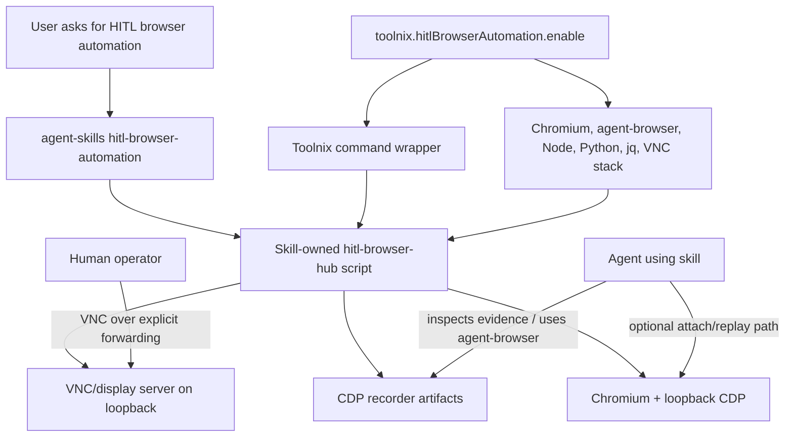

# feat: Add HITL browser automation skill and Toolnix runtime

## Summary

Implement HITL browser automation as a coordinated two-repo change: add the portable `hitl-browser-automation` skill package to `agent-skills`, then add a Toolnix opt-in that exposes the skill-owned runtime command and installs the browser/VNC dependencies needed to run it.

---

## Problem Frame

The origin requirements define the product shape: the skill owns the human-in-the-loop workflow and Browser Debug Hub scripts, while Toolnix owns declarative dependency provisioning for environments that want the workflow to work out of the box.

---

## Requirements

- R1. Add `hitl-browser-automation` to `agent-skills` as the primary workflow and script owner. `(see origin: docs/brainstorms/2026-05-25-hitl-browser-automation-toolnix-requirements.md)`
- R2. Preserve portable, Toolnix-independent operation with clear prerequisite checks and no Toolnix-specific assumptions in the skill. `(origin R2, R3)`
- R3. Preserve the HITL safety model: loopback-only VNC/CDP, explicit forwarding for remote access, sensitive artifact handling, and no secret requests in chat. `(origin R4, R15)`
- R4. Add a Toolnix opt-in for HITL browser automation that installs the skill-backed command plus required runtime dependencies without changing default environments. `(origin R6, R7, R9)`
- R5. Use the skill package as the source of truth for Browser Debug Hub runtime scripts; Toolnix wraps or exposes those scripts rather than maintaining a divergent copy. `(origin R8)`
- R6. Align Toolnix runtime configuration with existing Nix-managed browser tooling so `agent-browser` and the HITL workflow use the intended Chromium runtime. `(origin R10)`
- R7. Provide smoke validation and documentation for a manually provisioned VM path, with automated checks focused on browser/VNC/CDP/recorder plumbing. `(origin R12, R13, R14)`
- R8. Include a documented manual demo showing prompt-directed objective use from captured artifacts. `(origin R16, R17)`

**Origin actors:** A1 Human operator, A2 Agent using the skill, A3 Toolnix user or project consumer, A4 Toolnix maintainer, A5 Target environment
**Origin flows:** F1 Portable skill use outside Toolnix, F2 Toolnix-enabled runtime use, F3 Smoke VM proof, F4 Objective-specific manual demo
**Origin acceptance examples:** AE1 missing prerequisite reporting, AE2 artifact privacy, AE3 Toolnix option availability, AE4 skill-owned runtime, AE5 smoke VM proof, AE6 sequence inference demo, AE7 alternate objectives

---

## Scope Boundaries

- Do not add full VM provisioning automation; document a manual VM/bootstrap path only.
- Do not add browser-based VNC/noVNC.
- Do not vendor binary system dependencies inside the skill package.
- Do not make objective-specific inference a hard automated runtime test gate.
- Do not move Browser Debug Hub script ownership into Toolnix.
- Do not replace `agent-browser` or broaden this into a general browser automation platform.
- Do not include production-credential real-app validation in the first smoke proof.

### Deferred to Follow-Up Work

- Stronger automatic artifact redaction beyond existing obvious-header redaction.
- Browser-based remote viewing if classic VNC becomes too cumbersome.
- Fully automated VM provisioning once the manual VM proof is stable.
- Broader objective-specific eval suite after the manual demo reveals the most useful objective shapes.

---

## Context & Research

### Relevant Code and Patterns

**agent-skills**
- `README.md` defines the installable skill tree shape: custom skills under `lefant/`, vendored skills under `vendor/`.
- `docs/reference/agent-skill-authoring-best-practices.md` reinforces self-contained skill packaging, relative references, progressive disclosure, validation loops, and realistic evals.
- `docs/solutions/documentation-gaps/package-skill-required-reference-docs-2026-04-29.md` says runtime reference material must live inside the skill package, not only in repo-level docs.
- `docs/solutions/workflow-issues/vendor-skill-layout-discoverability-2026-04-29.md` records the discoverability cost of nested or misplaced skill roots.
- `scripts/check-vendor-layout.sh` is vendor-specific, but its frontmatter/layout validation style is a useful pattern for adding custom skill checks.

**toolnix**
- `toolnix:docs/reference/architecture.md` documents the dendritic feature/profile architecture, Home Manager vs `devenv` responsibility split, shared skills wiring, and existing browser-tool option semantics.
- `toolnix:modules/shared/browser-tools.nix` packages Nix-managed `agent-browser`, shared Chromium env, and `vhs`; reuse its browser environment contract rather than inventing a second Chromium path model.
- `toolnix:flake-parts/features/browser-tools.nix` shows the feature option/check pattern for Home Manager and `devenv` consumers.
- `toolnix:internal/profiles/home-manager/core.nix` owns persistent agent config and managed skill trees; this is where host-level skill visibility belongs.
- `toolnix:internal/profiles/devenv/core.nix` owns shell-local packages and env; it should expose commands/deps but not pretend to manage persistent agent skill discovery.
- `toolnix:docs/solutions/tooling-decisions/nix-browser-tool-cache-friendly-repack-2026-05-05.md` explains why Toolnix should reuse cache-friendly browser-tool package patterns and avoid unnecessary large local browser builds.
- `toolnix:docs/solutions/workflow-issues/local-readiness-verification-disk-pressure-2026-05-06.md` warns that full runtime verification can exhaust small exe.dev VM disks; classify capacity failures separately from module failures.

### Institutional Learnings

- Skill-required scripts, references, evals, and helper docs must ship inside the skill package to remain available after installation.
- Toolnix heavy browser/runtime capabilities must remain opt-in to avoid surprising default closure growth.
- Home Manager and `devenv` have different responsibilities: Home Manager can install persistent skill trees, while `devenv` can only provide shell-local commands and environment.
- Browser runtime checks should separate cheap package/config evaluation from heavier launch proofs.

### External References

- External research skipped. Existing local skill-authoring guidance and Toolnix browser tooling patterns are directly relevant and sufficient for planning.

---

## Key Technical Decisions

- Use a separate Toolnix option named `toolnix.hitlBrowserAutomation.enable` unless implementation discovers a naming conflict. The origin explicitly calls for a separate opt-in, and the dependency set is heavier than ordinary browser tooling.
- Make `toolnix.hitlBrowserAutomation.enable` imply `agent-browser` behavior but not `browserTools`/`vhs`. HITL needs `agent-browser` and Chromium, but terminal demo capture is unrelated.
- Install one primary Linux VNC/display stack through Toolnix for v0, preferring TigerVNC plus a lightweight window manager. The bundled runtime can keep fallback detection, but Toolnix should make the happy path deterministic.
- Expose `hitl-browser-hub` as the stable Toolnix command. The command should execute the skill-owned script from the `agent-skills` input and preserve target-project current working directory semantics.
- Keep runtime state outside the skill package and tracked project files by default. The existing user-state-root approach aligns with the privacy requirement better than writing raw browser artifacts under the repo tree.
- Treat automated smoke checks as plumbing checks. Manual objective demos document inference/replay/script generation behavior without overfitting v0 tests to one objective.
- Land agent-skills first, then bump Toolnix's `agent-skills` input or develop Toolnix against a local path override. Toolnix cannot reliably wrap a skill path that does not exist in its input.

---

## Open Questions

### Resolved During Planning

- Toolnix option shape: use a new explicit `toolnix.hitlBrowserAutomation.enable` feature that implies `agent-browser` support but not `vhs`.
- Script ownership: `agent-skills` owns Browser Debug Hub scripts; Toolnix wraps the skill-owned command.
- Automated smoke target: prove launch/VNC/CDP/recorder/teardown plumbing, not arbitrary objective inference.
- VM provisioning scope: document a manually provisioned VM flow; do not automate VM creation in v0.

### Deferred to Implementation

- Exact Nix package names for the VNC/display stack: verify the smallest reliable Linux set during implementation, likely TigerVNC plus a lightweight window manager.
- Exact wrapper implementation: decide whether Toolnix uses a simple shell wrapper package, a package data module, or both after testing store-path execution from the `agent-skills` input.
- Exact smoke artifact thresholds: tune the minimum event/screenshot/manifest checks once the smoke app and recorder run in the Toolnix-enabled environment.
- Exact manual demo wording and fixture flow: refine after the smoke app's button interactions and artifacts are visible.

---

## Output Structure

This plan spans two target repos. Paths below are repo-relative to the named repo.

```text
agent-skills:
  lefant/hitl-browser-automation/
    SKILL.md
    README.md
    references/
    scripts/
    evals/
  docs/brainstorms/2026-05-25-hitl-browser-automation-toolnix-requirements.md
  docs/plans/2026-05-25-001-feat-hitl-browser-automation-toolnix-plan.md

toolnix:
  modules/shared/hitl-browser-automation.nix
  flake-parts/features/hitl-browser-automation.nix
  internal/profiles/home-manager/core.nix
  internal/profiles/devenv/core.nix
  README.md
  docs/reference/architecture.md
```

The tree is directional. The implementer may adjust helper-file names if the final Toolnix feature naming convention favors a shorter or clearer module name.

---

## High-Level Technical Design

> *This illustrates the intended approach and is directional guidance for review, not implementation specification. The implementing agent should treat it as context, not code to reproduce.*



---

## Implementation Units

- U1. **Add the portable skill package to agent-skills**

**Goal:** Move the existing HITL browser automation package into the installable custom skill tree with all runtime instructions, references, scripts, smoke app assets, tests, and eval fixtures included.

**Requirements:** R1, R2, R3, R4, R5; origin F1, AE1, AE2, AE4

**Dependencies:** None

**Files:**
- Create: `lefant/hitl-browser-automation/SKILL.md`
- Create: `lefant/hitl-browser-automation/README.md`
- Create: `lefant/hitl-browser-automation/references/prerequisites.md`
- Create: `lefant/hitl-browser-automation/references/demonstration-handoff.md`
- Create: `lefant/hitl-browser-automation/references/verification-handoff.md`
- Create: `lefant/hitl-browser-automation/references/credential-handoff.md`
- Create: `lefant/hitl-browser-automation/references/vnc-client.md`
- Create: `lefant/hitl-browser-automation/references/trace-artifacts-and-privacy.md`
- Create: `lefant/hitl-browser-automation/references/real-app-validation.md`
- Create: `lefant/hitl-browser-automation/scripts/hitl-browser-hub`
- Create: `lefant/hitl-browser-automation/scripts/validate-package.sh`
- Create: `lefant/hitl-browser-automation/scripts/browser-debug-hub/**`
- Create: `lefant/hitl-browser-automation/evals/evals.json`
- Create: `lefant/hitl-browser-automation/evals/trigger-evals.json`

**Approach:**
- Copy the existing prototype package as the first maintained skill version rather than rewriting the runtime.
- Keep `SKILL.md` as workflow routing and safety guidance; keep mode-specific details in `references/`.
- Preserve the bundled Browser Debug Hub runtime under the skill's `scripts/` tree so the skill remains self-contained.
- Ensure script references are relative to the skill package and do not point at source-machine paths.
- Preserve executable bits for shell entrypoints and tests.

**Patterns to follow:**
- `docs/reference/agent-skill-authoring-best-practices.md` for skill package shape, trigger description, progressive disclosure, and validation.
- `docs/solutions/documentation-gaps/package-skill-required-reference-docs-2026-04-29.md` for self-contained runtime references.

**Test scenarios:**
- Happy path: package validation passes from the skill directory.
- Error path: removing a referenced `references/*.md` file makes package validation fail.
- Error path: prerequisite check reports missing VNC/browser dependencies clearly on a machine without them.
- Safety: package docs contain no source-machine absolute paths or instructions to paste credentials into chat.

**Verification:**
- `lefant/hitl-browser-automation/SKILL.md` exists with matching frontmatter name and a trigger description under the Agent Skills limit.
- `lefant/hitl-browser-automation/scripts/validate-package.sh` passes.
- The package can be copied independently and still contains all required workflow references and runtime scripts.

---

- U2. **Tighten skill command contract, state guidance, and objective demo**

**Goal:** Make the skill reliable as a Toolnix-wrapped runtime by documenting a stable command contract, target-project working-directory expectations, artifact privacy defaults, and prompt-directed objective demos.

**Requirements:** R2, R3, R4, R5, R7, R8; origin F1, F3, F4, AE2, AE5, AE6, AE7

**Dependencies:** U1

**Files:**
- Modify: `lefant/hitl-browser-automation/SKILL.md`
- Modify: `lefant/hitl-browser-automation/README.md`
- Modify: `lefant/hitl-browser-automation/references/trace-artifacts-and-privacy.md`
- Modify: `lefant/hitl-browser-automation/references/real-app-validation.md`
- Modify: `lefant/hitl-browser-automation/references/vnc-client.md`
- Create: `lefant/hitl-browser-automation/references/objective-demo.md`
- Modify: `lefant/hitl-browser-automation/evals/evals.json`

**Approach:**
- Document `scripts/hitl-browser-hub` as the stable command surface Toolnix may wrap.
- Clarify that normal operation should be invoked from the target project context, even when the command itself lives in the skill package or on PATH.
- Keep runtime state out of the skill package by default and explain how agents should inspect only necessary artifacts.
- Add a manual objective demo that covers at least these objective styles: report click sequence, reproduce same outcome, generate replay script, and continue automation.
- Keep the demo evidence-based: when artifacts do not support an objective, the agent should say what signal is missing rather than fabricate certainty.

**Patterns to follow:**
- Existing `lefant/hitl-browser-automation/references/credential-handoff.md` safety boundary for no secrets in chat.
- `docs/reference/agent-skill-authoring-best-practices.md` guidance to use references for detailed variants.

**Test scenarios:**
- Happy path: an agent reading `SKILL.md` can identify the correct reference for demonstration, verification, credential handoff, and objective demo use.
- Happy path: docs show PATH-wrapped usage without requiring `cd` into the skill package for normal operation.
- Safety: objective demo guidance forbids raw artifact paste/commit by default.
- Edge case: demo guidance explains what to do when captured evidence is insufficient for the requested objective.

**Verification:**
- Package validation passes after docs changes.
- Trigger evals include HITL prompts and negative prompts for ordinary browser automation.
- Manual review confirms Toolnix can wrap one stable script without needing private knowledge of the skill internals.

---

- U3. **Update agent-skills discovery docs and validation**

**Goal:** Make the new skill discoverable to repo maintainers and preserve layout/quality checks for future changes.

**Requirements:** R1, R2, R5

**Dependencies:** U1, U2

**Files:**
- Modify: `README.md`
- Optional modify: `docs/reference/agent-skill-source-map.md`
- Optional create: `docs/devlog/2026-05-25-hitl-browser-automation-skill.md`

**Approach:**
- Add `hitl-browser-automation` to the custom skills table.
- Note that it is intentionally script-bearing and self-contained.
- If a source map is maintained for custom skills, add the prototype/source relationship without using machine-specific absolute paths.
- Run repo-level skill quality checks available in the repository, plus the skill's own package validator.

**Patterns to follow:**
- `README.md` custom skill table style.
- `docs/solutions/workflow-issues/vendor-skill-layout-discoverability-2026-04-29.md` for discoverability mindset, even though this is a custom skill rather than a vendored skill.

**Test scenarios:**
- Documentation check: `README.md` lists the skill with a concise user-facing description.
- Layout check: the new custom skill lives at `lefant/hitl-browser-automation/SKILL.md`, not under a nested or ambiguous path.
- Validation: custom skill package validator passes.

**Verification:**
- A future maintainer can find the skill from `README.md` and understand that it is the runtime source Toolnix wraps.

---

- U4. **Add Toolnix HITL runtime feature data and option modules**

**Goal:** Add Toolnix feature data and options that install the runtime dependencies and expose the skill-owned `hitl-browser-hub` command for both Home Manager and `devenv` consumers.

**Requirements:** R4, R5, R6; origin F2, AE3, AE4

**Dependencies:** U1, U2

**Files:**
- Target repo: `toolnix`
- Create: `modules/shared/hitl-browser-automation.nix`
- Create: `flake-parts/features/hitl-browser-automation.nix`
- Modify: `internal/profiles/home-manager/core.nix`
- Modify: `internal/profiles/devenv/core.nix`
- Modify: `flake.lock`
- Modify: `devenv.lock`

**Approach:**
- Resolve `agent-skills` through the same input-resolution pattern used by existing shared modules.
- Build a small Toolnix package or wrapper that exposes `hitl-browser-hub` on PATH and delegates to `agent-skills`'s `lefant/hitl-browser-automation/scripts/hitl-browser-hub`.
- Preserve the caller's current working directory when invoking the skill-owned script.
- Reuse existing browser-tools package data for Nix-managed `agent-browser` and Chromium env rather than constructing a second browser runtime contract.
- Add runtime packages for Node, Python, `jq`, and the chosen VNC/display stack.
- Define `toolnix.hitlBrowserAutomation.enable` for Home Manager and `devenv`, defaulting to false.
- In profile composition, make the HITL option imply `agentBrowser` behavior but not `browserTools`/`vhs`.
- Bump Toolnix's `agent-skills` input after the skill lands, or document local path override use during development.

**Patterns to follow:**
- `toolnix:modules/shared/browser-tools.nix` for browser package/env data.
- `toolnix:flake-parts/features/browser-tools.nix` for option modules and checks.
- `toolnix:internal/profiles/home-manager/core.nix` and `toolnix:internal/profiles/devenv/core.nix` for effective boolean composition.

**Test scenarios:**
- Covers AE3. Given default Toolnix settings, HITL runtime packages and VNC dependencies are absent.
- Covers AE3. Given `toolnix.hitlBrowserAutomation.enable = true` in Home Manager, the command wrapper, `agent-browser`, Chromium runtime binding, Node, Python, `jq`, and VNC/display packages are present.
- Covers AE3. Given `toolnix.hitlBrowserAutomation.enable = true` in `devenv`, the shell has the same command/dependency availability, but persistent agent skill tree management remains a Home Manager responsibility.
- Covers AE4. Given Toolnix wraps the command, changing the skill-owned script in `agent-skills` is sufficient after an input bump; Toolnix does not carry a copied runtime tree.
- Error path: if the `agent-skills` input lacks the expected skill path, Toolnix evaluation or wrapper build fails clearly.

**Verification:**
- Toolnix flake checks evaluate package selection for default, browserTools, agentBrowser, and hitlBrowserAutomation modes.
- The wrapper points at the `agent-skills` input path and does not duplicate Browser Debug Hub scripts into Toolnix source.

---

- U5. **Add Toolnix validation checks and documentation**

**Goal:** Prove Toolnix option behavior cheaply in flake checks, document the user-facing contract, and distinguish host-level skill install from project-shell runtime support.

**Requirements:** R4, R5, R6, R7; origin F2, F3, AE3, AE4, AE5

**Dependencies:** U4

**Files:**
- Target repo: `toolnix`
- Modify: `flake-parts/features/hitl-browser-automation.nix`
- Modify: `README.md`
- Modify: `docs/reference/architecture.md`
- Optional create: `docs/reference/hitl-browser-automation.md`
- Optional create: `docs/devlog/2026-05-25-hitl-browser-automation-runtime.md`

**Approach:**
- Add checks that instantiate Home Manager and `devenv` configurations with the option disabled and enabled.
- Assert default package sets remain light and do not include HITL VNC/display packages.
- Assert enabled package sets include the wrapper and dependencies.
- Assert enabled environments include the browser env variables expected by the skill runtime.
- Document that Home Manager manages persistent skill trees for agents, while `devenv` provides shell-local command/dependency availability.
- Add first-run guidance for a manually provisioned VM: enable the option, enter the environment, run prerequisite check, start the hub, connect through VNC forwarding, run smoke validation, stop the hub.
- Mention disk-pressure guidance for full local runtime proofs on small exe.dev VMs.

**Patterns to follow:**
- `toolnix:flake-parts/features/browser-tools.nix` package-selection checks.
- `toolnix:README.md` examples for optional feature enablement.
- `toolnix:docs/solutions/workflow-issues/local-readiness-verification-disk-pressure-2026-05-06.md` for verification reporting and small-VM cautions.

**Test scenarios:**
- Documentation check: README includes a minimal enablement snippet for `toolnix.hitlBrowserAutomation.enable`.
- Evaluation check: default Home Manager and `devenv` configs do not include HITL runtime packages.
- Evaluation check: enabled Home Manager and `devenv` configs include the command wrapper and runtime deps.
- Binding check: enabled env points browser execution at Toolnix-managed Chromium.
- Contract check: docs state that Toolnix wraps the skill-owned runtime from `agent-skills`.

**Verification:**
- `nix flake check --no-build` succeeds for Toolnix after adding the feature checks.
- Documentation distinguishes skill portability, Home Manager skill install, and `devenv` runtime support.

---

- U6. **Add smoke app/manual objective proof coverage**

**Goal:** Ensure the smoke app and tests exercise the v0 promise: a human can click through a visible flow over VNC, browser evidence is captured, and an agent can inspect the artifacts for a prompt-directed objective.

**Requirements:** R3, R7, R8; origin F3, F4, AE5, AE6, AE7

**Dependencies:** U1, U2, U4

**Files:**
- Modify: `lefant/hitl-browser-automation/scripts/browser-debug-hub/smoke-app/server.mjs`
- Modify: `lefant/hitl-browser-automation/scripts/browser-debug-hub/smoke-app/public/index.html`
- Modify: `lefant/hitl-browser-automation/scripts/browser-debug-hub/tests/smoke-app.test.sh`
- Modify: `lefant/hitl-browser-automation/scripts/browser-debug-hub/tests/launcher-safety.test.sh`
- Modify: `lefant/hitl-browser-automation/scripts/browser-debug-hub/tests/cdp-recorder-smoke.test.sh`
- Modify: `lefant/hitl-browser-automation/references/objective-demo.md`
- Target repo optional modify: `toolnix:docs/reference/hitl-browser-automation.md`

**Approach:**
- Keep automated smoke tests focused on plumbing: HTTP smoke app behavior, launcher safety, loopback metadata, recorder artifacts, screenshots, and teardown.
- Make the smoke app interaction-rich enough to create objective-useful evidence: visible controls, deterministic state change, and network-visible events or state.
- Add or refine tests so empty artifacts, missing recorder metadata, and unsafe bind regressions fail.
- Add manual demo steps that tell the human to click a short button sequence and tell the agent what objective to satisfy.
- Keep objective assertions in the manual demo, not as a required automated test, unless an objective can be checked deterministically without human input.

**Patterns to follow:**
- Existing Browser Debug Hub smoke tests in the skill runtime.
- Origin acceptance examples AE5-AE7.

**Test scenarios:**
- Covers AE5. Happy path: launcher safety test starts the hub when prerequisites exist and verifies loopback VNC/CDP metadata.
- Covers AE5. Happy path: CDP recorder smoke test produces a manifest, screenshots, and network/event evidence against the smoke app.
- Error path: recorder smoke fails if artifact metadata is missing or empty after expected interaction.
- Error path: launcher safety reports missing dependencies cleanly when the runtime stack is absent.
- Manual demo: human clicks a sequence over VNC; agent inspects artifacts and reports sequence or final state according to the prompt.
- Manual demo: user asks for a replay script; agent uses the same artifacts to produce the requested script or identifies missing evidence.

**Verification:**
- Skill package validation passes.
- Runtime tests pass in a Toolnix-enabled environment with browser/VNC prerequisites.
- The manual objective demo can be followed by a later agent without reading the original brainstorming conversation.

---

- U7. **Run cross-repo readiness verification and record outcomes**

**Goal:** Validate the coordinated change across both repos and leave durable notes for future maintainers.

**Requirements:** R1, R4, R5, R7, R8

**Dependencies:** U3, U5, U6

**Files:**
- Optional create: `docs/devlog/2026-05-25-hitl-browser-automation-toolnix.md`
- Target repo optional create: `toolnix:docs/devlog/2026-05-25-hitl-browser-automation-runtime.md`
- Target repo optional modify: `toolnix:README.md`

**Approach:**
- Verify the agent-skills package independently first.
- Verify Toolnix evaluation/package-selection checks after the `agent-skills` input includes the new skill.
- Run runtime smoke checks only in an environment with sufficient browser/VNC dependencies and disk headroom.
- Record any not-applicable or blocked checks clearly, especially if the current VM lacks runtime dependencies or disk capacity.
- Add devlog notes describing the final option name, dependency set, smoke result, and any deferred limitations.

**Patterns to follow:**
- `toolnix:docs/solutions/workflow-issues/local-readiness-verification-disk-pressure-2026-05-06.md` for verification status reporting.
- Existing `docs/devlog/*` conventions in both repos.

**Test scenarios:**
- Agent-skills static validation passes.
- Toolnix `nix flake check --no-build` passes after feature checks are added.
- Toolnix enabled environment can run `hitl-browser-hub check --json` and report all required runtime tools present.
- Manual VM proof reaches VNC-visible smoke app and produces recorder artifacts.
- Cleanup: stopping the hub leaves no obvious managed browser/VNC/recorder processes running.

**Verification:**
- A maintainer can read the devlog and understand what was proven, what was skipped, and which follow-ups remain.

---

## System-Wide Impact

- **Interaction graph:** The feature connects installed agent skills, Toolnix feature flags, Nix-managed browser tooling, VNC/display processes, Chromium CDP, local artifact storage, and `agent-browser` continuation/replay.
- **Error propagation:** Missing prerequisites should fail before partial browser startup. Toolnix wrapper failures should identify missing skill input paths or missing runtime packages. Runtime failures should preserve enough logs to diagnose without exposing secrets.
- **State lifecycle risks:** Browser profiles, screenshots, network captures, and logs can contain sensitive data and grow over time. Keep state outside the skill package and avoid tracked raw artifacts.
- **API surface parity:** Home Manager and `devenv` should agree on option semantics for package/env availability, while preserving their different responsibilities for persistent skill installation.
- **Integration coverage:** Package-selection checks prove option behavior; runtime smoke tests prove VNC/CDP/recorder behavior; manual objective demo proves prompt-directed evidence use.
- **Unchanged invariants:** Default Toolnix environments remain light; `browserTools` still means `agent-browser` + `vhs` + Chromium; `agent-browser` remains the browser automation engine.

---

## Risks & Dependencies

| Risk | Mitigation |
|------|------------|
| Toolnix wraps a skill path before the new skill exists in its pinned input | Land agent-skills first, then bump Toolnix inputs or use a local path override during development. |
| VNC/display package choice is unreliable on target VMs | Start with one Linux stack, validate on an exe.dev VM, and keep fallback detection in the skill runtime. |
| Runtime artifacts leak secrets | Preserve loopback-only defaults, keep artifacts local/untracked, document no raw paste/commit behavior, and avoid credential-bearing real-app smoke tests. |
| Toolnix default closure grows unexpectedly | Add feature checks asserting default package absence and keep HITL runtime behind its own option. |
| Devenv users assume persistent skills are installed | Document that `devenv` provides commands/deps while Home Manager owns persistent skill tree wiring. |
| Browser runtime checks exhaust small VM disks | Keep default checks cheap, run full runtime smoke only when capacity is sufficient, and classify disk exhaustion as blocked/not-applicable before changing code. |
| Objective demo over-promises inference quality | Keep objective behavior prompt-directed and evidence-bound; require the agent to report missing signals when artifacts are insufficient. |

---

## Documentation / Operational Notes

- Agent-facing workflow docs live inside `lefant/hitl-browser-automation/` so installed skills remain self-contained.
- Toolnix docs should present the Nix-enabled path as the recommended way to satisfy dependencies, not as a requirement for using the skill.
- Home Manager docs should explain persistent skill installation; `devenv` docs should focus on shell-local runtime availability.
- The manual VM proof should include prerequisite check, VNC forwarding guidance, smoke app interaction, artifact inspection, and teardown.
- Do not commit raw browser profiles, traces, cookies, tokens, screenshots with secrets, or real-app credential material.

---

## Sources & References

- **Origin document:** [docs/brainstorms/2026-05-25-hitl-browser-automation-toolnix-requirements.md](../brainstorms/2026-05-25-hitl-browser-automation-toolnix-requirements.md)
- Skill authoring reference: [docs/reference/agent-skill-authoring-best-practices.md](../reference/agent-skill-authoring-best-practices.md)
- Skill packaging solution: [docs/solutions/documentation-gaps/package-skill-required-reference-docs-2026-04-29.md](../solutions/documentation-gaps/package-skill-required-reference-docs-2026-04-29.md)
- Skill discoverability solution: [docs/solutions/workflow-issues/vendor-skill-layout-discoverability-2026-04-29.md](../solutions/workflow-issues/vendor-skill-layout-discoverability-2026-04-29.md)
- Toolnix architecture: `toolnix:docs/reference/architecture.md`
- Toolnix browser tools requirements: `toolnix:docs/brainstorms/2026-05-05-browser-tools-requirements.md`
- Toolnix browser tools plan: `toolnix:docs/plans/2026-05-05-001-feat-browser-tools-plan.md`
- Toolnix browser-tool repacking solution: `toolnix:docs/solutions/tooling-decisions/nix-browser-tool-cache-friendly-repack-2026-05-05.md`
- Toolnix disk-pressure verification solution: `toolnix:docs/solutions/workflow-issues/local-readiness-verification-disk-pressure-2026-05-06.md`
